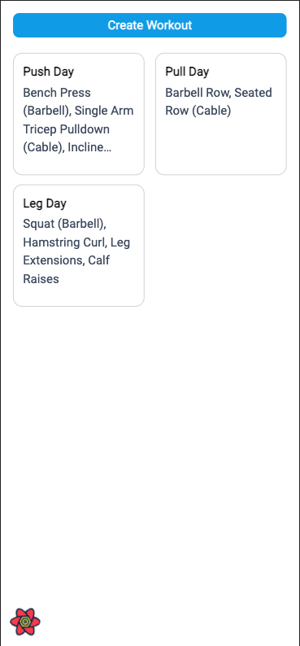
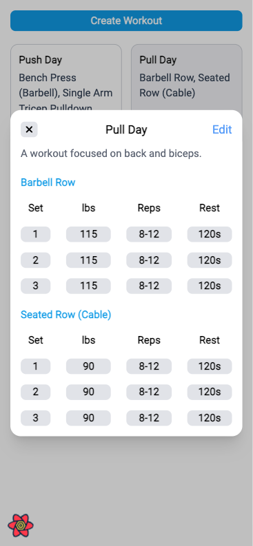
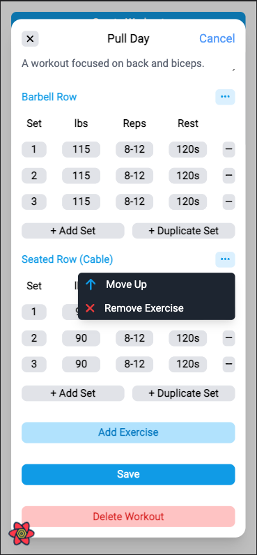

# 🧐 About

Creating a MERN full-stack application for creating and updating workout plans based off the [Strong](https://www.strong.app/) app.

# 📱 Mobile Friendly

|            Home page             |            Workout View             |            Edit Workout View             |
| :------------------------------: | :---------------------------------: | :--------------------------------------: |
|  |  |  |

<!-- 

    

        
    

    

        
    

 -->

# 🧑‍💻 Tech Stack

- [ReactJS](https://reactjs.org/)
- [ExpressJS](https://expressjs.com/)
- [MongoDB](https://www.mongodb.com/home)
- [NodeJS](https://nodejs.org/en/)
